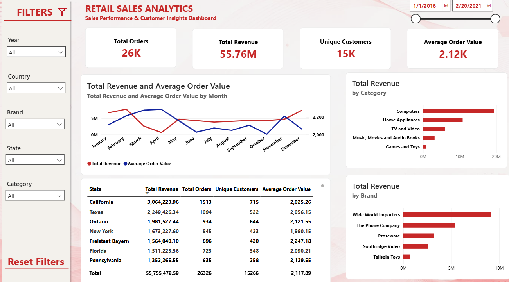

# 🛍️ Retail Sales Analytics Dashboard

A complete end-to-end Business Intelligence project where raw retail sales data was cleaned using **Power Query**, analyzed with **SQL**, and transformed into an interactive **Power BI** dashboard using **DAX** and **Data Modeling**.

This project transforms raw retail sales data into actionable business insights by analyzing revenue trends, customer purchasing behavior, product performance, and key business KPIs through an interactive Power BI dashboard.

---

## 📊 Dashboard Preview

---

## 🎯 Project Objectives

- Analyze overall retail sales performance.
- Track revenue, orders, and customer growth.
- Identify top-performing products, categories, and brands.
- Understand customer purchasing behavior.
- Build an interactive dashboard for business decision-making.

---

## 🛠️ Tools & Technologies Used

- **Power BI**
- **Power Query** (Data Cleaning & Transformation)
- **SQL** (Data Extraction & Analysis)
- **DAX** (Calculated Measures & KPIs)
- **Data Modeling**

---
## 📂 Dataset

**Dataset:** Global Electronics Retailer

**Source:** Maven Analytics

**Files Used:**
- Customers
- Products
- Sales
- Stores
- Exchange_Rates

---

## 📌 Key KPIs

- Total Revenue
- Total Orders
- Unique Customers
- Average Selling Price
- Quantity Sold
- Top Brand
- Sales by Category
- Monthly Revenue Trend
- Customer Insights

---

## 📈 Dashboard Features

### Executive Overview
- Total Revenue
- Total Orders
- Unique Customers
- Average Selling Price
- Top Brand

### Sales Analysis
- Monthly Sales Trend
- Revenue Analysis
- Category-wise Quantity Sold
- Brand Performance

### Customer Analytics
- Customer Distribution
- Customer Revenue Analysis
- Average Orders per Customer
- Customer Segmentation

---

## 🧹 Data Preparation

The dataset was cleaned and transformed using **Power Query** by:

- Removing duplicate records
- Handling missing values
- Correcting data types
- Creating calculated columns
- Preparing tables for analysis

---

## 💡 Business Insights

- Identified top-performing brands and categories.
- Tracked monthly sales patterns and seasonal demand.
- Analyzed customer purchasing behavior.
- Identified top-performing products and brands based on revenue.
- Built interactive filters for dynamic business reporting.

---

## 🚀 Skills Demonstrated

- Business Intelligence
- Data Cleaning
- SQL Querying
- Data Modeling
- DAX Calculations
- Interactive Dashboard Design
- KPI Reporting
- Data Visualization
- Business Insight Generation

---

## 👨‍💻 Author

**Naveen Bemad**

Aspiring Data Analyst

